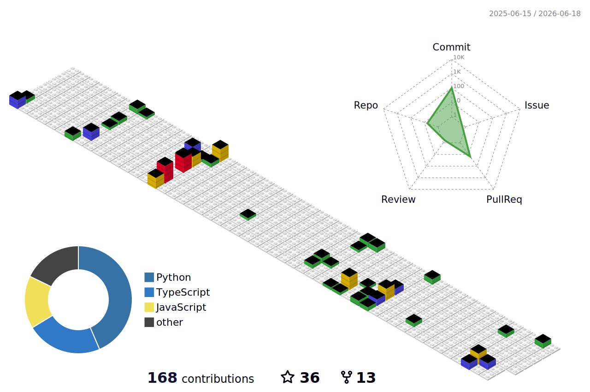

# Hi, I'm Mehul Ligade 👋

 

---

I build production AI systems where something real is at stake. Tight budgets, no internet, live phone calls — constraints that make the standard solution impossible are where I do my best work.

---

## What I've shipped

| | |
|---|---|
| **94% AI cost reduction** | Rebuilt inference pipeline from scratch, Rs. 350 to Rs. 20 per unit in production |
| **Rs. 30L+ saved annually** | Multi-agent automation pipelines replacing entirely manual workflows |
| **Voice AI under 500ms** | Real-time AI agent on live phone calls, custom Cerebras CS-2 inference architecture |
| **Full LLM offline in 1GB** | Quantised LLM on-device on budget Android hardware, zero cloud dependency |

---

## Projects

### 🎙️ [Aurora](https://github.com/mehulcode12/aurora) — Real-Time Voice AI Agent

Standard LLM APIs take 3 to 5 seconds. That makes natural phone conversation impossible. Built a custom 3-stage inference architecture — hitting under 500ms end to end. Live in production at 99.7% success rate.

   

---

### 🎨 [agentdraw-canvas](https://www.npmjs.com/package/agentdraw-canvas) — Published npm Package

Canvas engine that gives AI agents a programmatic drawing hand. Every shape gets a UUID so agents create, update, animate, or delete elements across sessions and multi-step operations. Plugin architecture across 13 independent ES modules. 111 weekly downloads at peak.

  

---

## Stack

<!-- Uniform HTML formatting prevents the markdown parser from breaking -->

            

---

## Technical Writing 

I write about productionizing AI, solving edge cases, and moving beyond basic GenAI wrappers on **[Medium](https://medium.com/@mehulligade12)** & **Towards AI**.

<!-- BLOG-POST-LIST:START -->* 🧠 [How RAG Actually Finds Answers &lpar;Part 2&rpar;: HNSW, IVF, BM25, Hybrid Search and Re-Ranking | M011 |…](https://pub.towardsai.net/how-rag-actually-finds-answers-part-2-hnsw-ivf-bm25-hybrid-search-and-re-ranking-m011-e789f977c99b?source=rss-8db515515ff4------2) — *Latest technical publication.** 🧠 [RAG Explained From Scratch &lpar;Part 1&rpar;: How PDFs Become Searchable Knowledge for AI | M010 | Mehul…](https://pub.towardsai.net/rag-explained-from-scratch-part-1-how-pdfs-become-searchable-knowledge-for-ai-m010-mehul-4edff62f5aeb?source=rss-8db515515ff4------2) — *Latest technical publication.** 🧠 [Fine-Tuning is Dead: Why Context Orchestration Won in 2026 | M009](https://pub.towardsai.net/fine-tuning-is-dead-why-context-orchestration-won-in-2026-m009-ef07112c437c?source=rss-8db515515ff4------2) — *Latest technical publication.*<!-- BLOG-POST-LIST:END -->

---

## GitHub Stats & Metrics

  
  

 

### 📊 3D Isometric Contributions Graph

  <picture>
    <source media="(prefers-color-scheme: dark)" srcset="profile-3d-contrib/profile-night-rainbow.svg">
    <source media="(prefers-color-scheme: light)" srcset="profile-3d-contrib/profile-gitblock.svg">
    
  </picture>

---

## Beyond code

* 📖 Authored a chapter in a published book on Artificial Intelligence
* 📜 Filed 6 copyrights with 1 patent application in process
* 🏆 Won national-level project competitions 3 times
* 👥 Mentored 20+ students on AI implementation

---

## Let's Build

> **I'm currently open to new opportunities and consulting.** If you are dealing with heavy optimization problems, architecture bottlenecks, or need custom multi-agent rollouts, let's talk.
> 
> 💬 Drop me an [email](mailto:mehulligade12@gmail.com) or find me on [LinkedIn](https://linkedin.com/in/mehulcode12).

---

### ⚡ Recent Engineering Activity

<!--START_SECTION:activity-->
1. ❌ Closed PR [#1](https://github.com/mehulcode12/agentdraw-canvas/pull/1) in [mehulcode12/agentdraw-canvas](https://github.com/mehulcode12/agentdraw-canvas)
<!--END_SECTION:activity-->

 

*The problems I enjoy most are the ones where the standard solution doesn't exist yet.*

